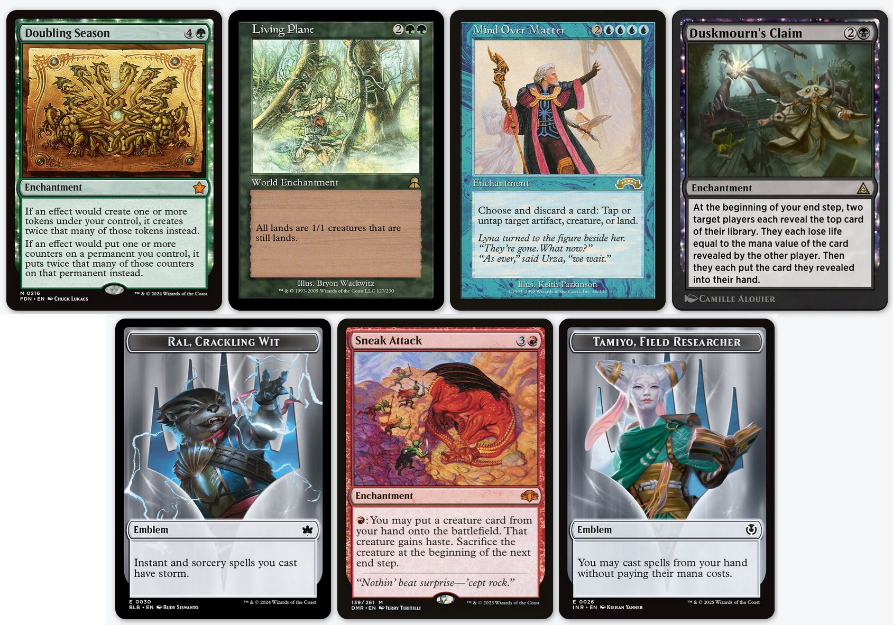
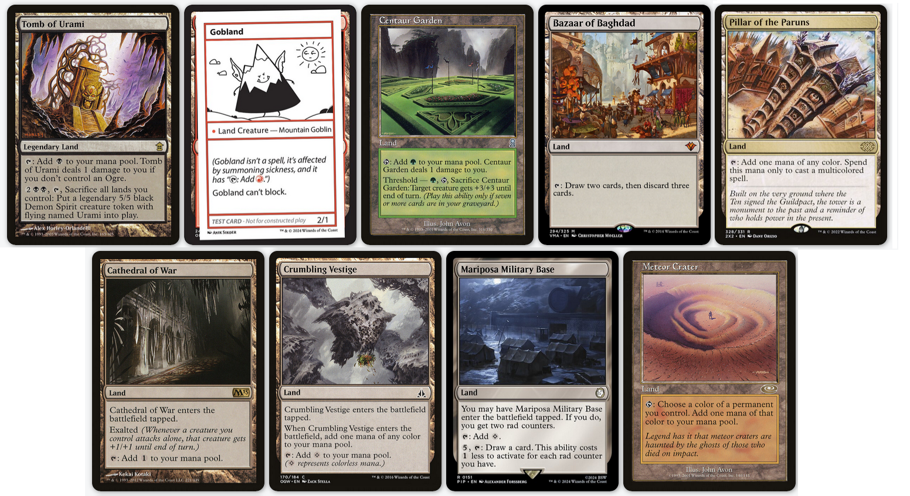

# Archetypes of gimmick cubes

Andy Mangold popularised this style of cube with [100 ornithopters](https://cubecobra.com/cube/overview/100-ornithopters), a cube where 100 out of 360 cards are copies of Ornithopter. I recommend Rhystic Studies' [video essay](https://www.youtube.com/watch?v=Pddm1gbBuWE) on it. 

If the circulation of ornithopters ever runs out (presumably because of how many people are building their own 100 ornithopter cubes), and we aren't yet in a future post-apocalyptic wasteland where ornithopters are used as currency like caps in fallout, you might consider building your cube with 100 copies of the following cards:

## Emblem Cubes
Emblem cubes ask "How would the game be different if you started the game with ___ on the battlefield?" The most popular version of this concept, as far as I can tell, is Zennith's [cascade cube](https://cubecobra.com/cube/overview/cascadecube), where every player starts with a copy of Maelstrom Nexus on the battlefield.

I'll leave you to ponder the implications of starting the game with one of these 7 cards as emblems.

## Desert Cubes
Sometimes when I manage to get 8 people together for cube night, I run out of basic lands (I stock 30 of each), and we have to come up with convoluted solutions like saying "BTW, my swamps are proxies for mountains" before the game starts. Desert Cubes solve this problem by not having a land station. Or sometimes it's a partial desert cube and then only some of the basic lands are there.

Desert cubes make for great flavour sometimes, like [The Forbidden Cube](https://cubecobra.com/cube/overview/noswamps), which has all the best black cards, but no swamps in the basic land station, symbolizing tapping into forbidden dark powers. The inverse can be found in the [Pulp Nouveau](https://cubecobra.com/cube/overview/pulpnouveau) cube, where there's only swamps, symbolising a noir-inspired, pulpy world full of greed and crime.

So, here's my pitch- Throw out your land station, pick one of these, and stuff your cube full of 'em:

## Rule Overhaul Cubes
What if both players shared a library? What if we were playing by hearthstone rules, and creatures could attack each other directly? 

What if we started with our entire library in our graveyard?
What if every creature had changeling?

## Power-Level Cubes

## Draft-Gimmick Cubes

## Multiplayer Cubes
Multiplayer magic is a gimmick. EDH is a meme format, and I feel confident saying that because I've played so many hours of EDH. 

