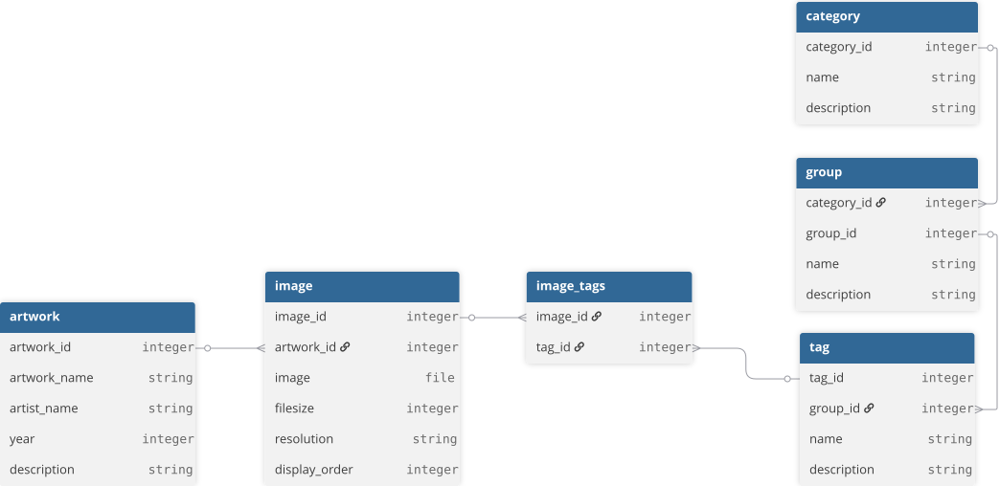
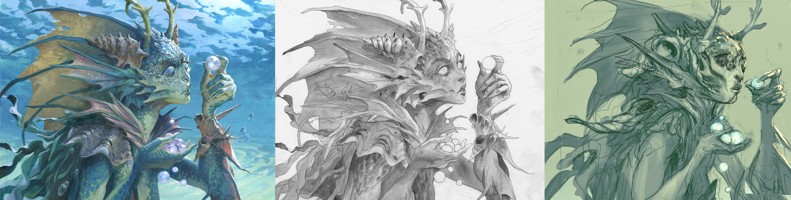

I'm building a full stack app I'm naming "Human Art Archive" to, well, archive human art. It does what it says on the tin. You'll be able to find it on humanartarchive.com in the future. [Last time](https://trollkarlsson.com/blog/1-intent/) I spoke about the why, now we're onto the *how*, beginning with the large scale architecture.

# Scope
I'm very wary of scope-creep. I have previously tried to make this app, and while I did make something that worked and I was proud of, I eventually gave up on the project because of scope-creep. I kept constantly adding more features without thinking too much of it, leading to me never feeling done or accomplished. This time, I'm going to explicitly define the scope of the Minimum Viable Product (MVP), and limit myself to only making that (Look forward to Part 6: "Breaking the scope"...).

The MVP should have the following:
1. A front-end displaying a grid of various artworks, and the ability to upload and tag artwork.
2. A search field that lets a user filter through artworks by tags, artwork name, artist name, year made.
3. A database of artwork that retrieves the appropriate art based on the user's filtered search.

# Architecture

These three points in the MVP effectively represents the app's front-end, back-end, and the database, respectively. I have some experience from university working with Docker, SQL databases, and the REST API, so I'll use those. I don't have a lot of front-end experience, but from my experimentation, Vue/Nuxt seems to do everything I need it to without too much complexity, so I'm eager to learn it.

Without overcomplicating it and adding all the small necessary datapoints, I think the database will look something like this:

Tags exist inside of tag groups, and tag groups exist inside of categories. There's probably going to be only 3 categories: Meta, Form, and Content.
- Meta's tags will tell you if the artwork is part of a collection, if a real-life person is depicted, etc. Pieces of information that exist outside of the image itself.
- Form's tags describe the medium (digital, oil on canvas), art movements (baroque, pre-raphaelite), etc.
- Content tags for a character could classify their gender, describe what color their hair is, etc. Content tags for a landscape could tell... something. I'm not an art scholar. I'll figure that out later.

Every artwork can have a bunch of images (think different versions, a sketch, a final digital render, etc.), and every image can have a bunch of tags to display it's contents. These three images below would all have the exact same tags for content (e.g. mermaid), but would have different tags for the artwork's form (final render, sketch, concept art). 

 
# Next time, in Part 3
Come back to the next blogpost in the series to hopefully see the most basic version of the app deployed.
