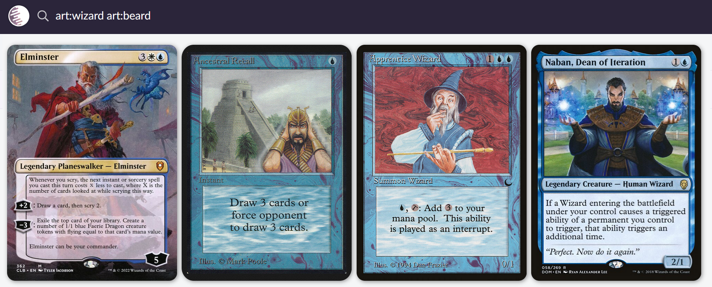

I'm building a full stack app I'm naming "Human Art Archive" to, well, archive human art. It does what it says on the tin. You'll be able to find it on humanartarchive.com in the future.

Here are your questions, which I'll answer in reverse order:
- What are you making?
- Why are you making it?
- Why are you telling me about this?

# Why are you telling me about this?
Obviously, providing proper documentation with your app makes it easier for others, human or robot, to collaborate with you. Besides that though, I find that documenting your own process of working through building an app like this provides a great mental boost. Due to the fact that it forces you to process your own thoughts and put them down into words on your screen, you're provided with a higher level of mental clarity than if you keep the idea purely in you head. It's kind of like journaling your real life to help with your emotions. 

Now, of course, I could be wrong. Maybe documenting all of this is a big waste of my time. But, the only way to find out is to try. I can document the entire process here and then, in what I suspect will be the last blog post of this series, I can tell you about all of the mistakes I've made in the process. If I do my job writing this blog well, I'll learn and reflect from my mistakes, and maybe even be able to help other readers in the same way I've helped myself.

# Why are you making it?

My favourite hobby, which I'm sure I'll write about on this blog at some point, is Tabletop Role-Playing Games (TTRPGs). If you've ever heard of Dungeons & Dragons (D&D), it is the most popular TTRPG. Maybe someday it'll be the [Generic Trademark](https://en.wikipedia.org/wiki/Generic_trademark) for TTRPGs. I make this app particularly to serve the needs of myself and my friends with whom I play this game. When we play in this hobby we are often in need of finding an image for a character/place/item/etc. with highly specific details. In this game, Jim might tell me: "So he is an old man, long gray beard, classic wizard's robes, big wizard hat... and he has purple eyes and a massive scar across his face!". I can visualise what this looks like in my head, but I want a picture of this character to put on my screen, so, how can I get a picture like that?

- We could draw it ourselves, but we're no good at drawing and it'd look nothing like our imaginations.
- We could ask Gemini/ChatGPT/etc. to draw it for us, but we prefer our art to be made by humans, not robots.
- We could try and search for something similar online, but [google has severely enshittified](https://pluralistic.net/2024/04/24/naming-names/#prabhakar-raghavan) their search engine, and many art websites like Artstation are more and more filled with AI "art".

The only option I see left is to browse [Cara](https://cara.app/explore) until I find what I want. While Cara is a great app, I still desire out of Cara more art tags and a better search tool, so that I could filter through the masses of art to find exactly what I want. 

# What am I making?
So, first of all, I'm making something that will look nice on my portfolio, and that will develop my skills- I am, after all, looking for a job in tech. Until I find a job that will pay me to code, I'll code in my (plentiful) free time.

As for the technical details, I want a website that:
- Hosts art
- Lets users tag the art
- Allows me to search it by tags
That way, if I had ever uploaded an image of a wizard, and given it the tags "robes, hat, beard, scar", I should be able to search for any of those tags, along with operators like AND, OR, NOT, etc. to find a highly specific piece of art.

A website that does something like this very well is [Scryfall](https://scryfall.com), it has an incredibly powerful search engine, allowing you to search its database along many different axis, but it only stores Magic: The Gathering cards (Another big hobby of mine, blogpost about that coming up real soon). Here you can see me searching Scryfall for cards where the art includes a wizard and a beard.

# Next time, in Part 2
Come back to the next blogpost in the series for a discussion on how I'll be making all of this. Tech stack, data flows, project scope, etc.